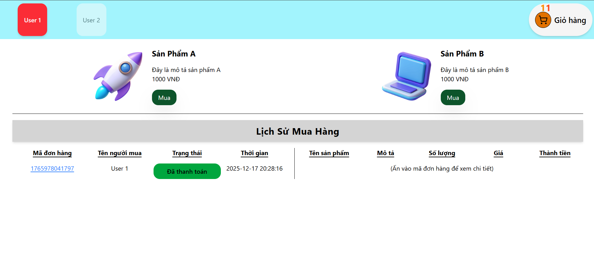
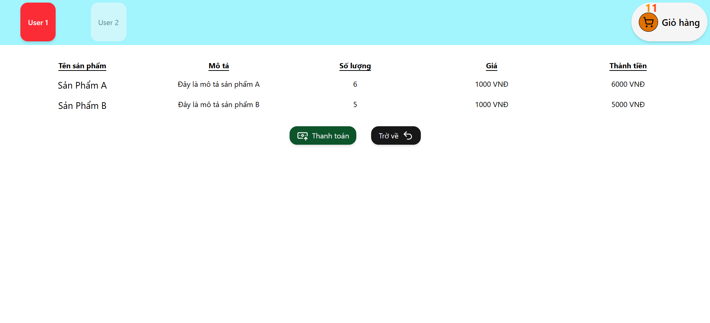
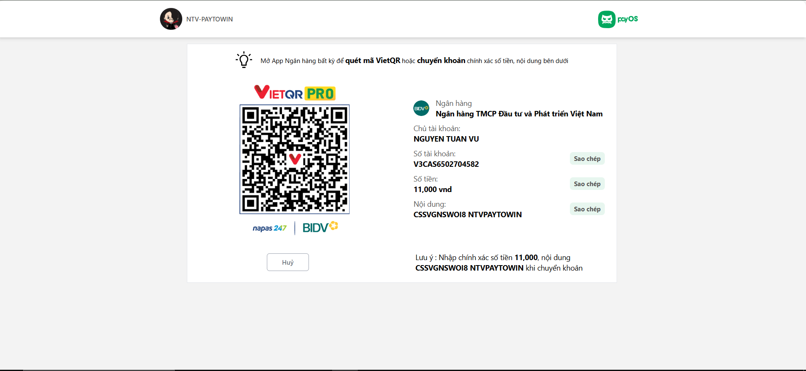
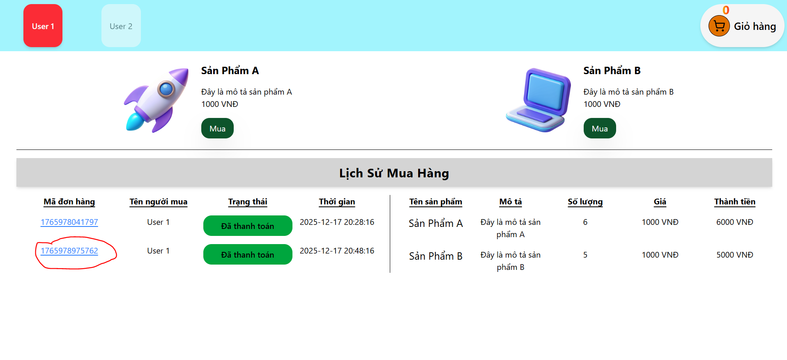

# 🚀 Tích hợp thanh toán tự động trực tuyến với PAYOS + VietQR

## 📌 Giới thiệu

Ứng dụng MERN Stack cho phép người dùng thực hiện **thanh toán trực tuyến tự** động với **PAYOS + VietQR** — tách rõ frontend & backend, hỗ trợ cấu trúc sạch, middleware, controller đầy đủ và có backend webhook

📌 Lưu ý quan trọng:
Dự án này KHÔNG xây dựng chức năng đăng nhập / đăng ký.
Hệ thống giả định người dùng đã đăng nhập sẵn, có userId được tạo trước trong database và frontend chỉ tập trung vào luồng tạo đơn hàng & thanh toán.

Ứng dụng được tách rõ:

- Frontend: hiển thị UI, tạo yêu cầu thanh toán

- Backend: xử lý tạo payment link, lưu order, nhận webhook xác nhận thanh toán

---

## 🖼️ Demo / Screenshot

### **Demo**

https://payment-online-upload.vercel.app/

### **Screenshot**







---

## 🛠️ Tech Stack

### Frontend

- React + TypeScript
- Vite
- Zustand (quản lý state)
- Axios
- React Router DOM
- VietQR UI (hiển thị QR thanh toán)

### Backend

- TypeScript
- Node.js + Express.js
- MongoDB + Mongoose
- Crypto (Tạo chữ ký Signature)
- Create PaymentLink / Confirm Webhook
- Ngrok giả lập https

---

## 🧰 Công nghệ và khái niệm chính

### **PAYOS Payment Link**

- Backend tạo payment link từ PAYOS.
- PAYOS trả về: URL thanh toán - QR code VietQR - orderCode
- Frontend dùng thông tin này để hiển thị cho người dùng thanh toán.

### **VietQR**

- Hiển thị mã QR cho người dùng quét bằng app ngân hàng.
- Nội dung QR gắn với orderCode và số tiền thanh toán.
- Khi người dùng thanh toán xong, PAYOS sẽ gửi webhook về backend.

### **Webhook PAYOS**

- PAYOS gọi webhook tới backend khi: Người dùng quét mã thanh toán - Thành công/thất bại/hủy/...
  -Backend: Xác thực webhook => Cập nhật trạng thái đơn hàng trong MongoDB

### **Node.js + Express.js**

- Backend tiếp nhận, xử lý, gửi phản hồi, cung cấp API xác thực.

### **MongoDB + Mongoose**

- Lưu thông tin order, thông tin QR, thông tin giao dịch từ PAYOS.

---

## 🔄 Quy trình thanh toán

**1. User truy cập Frontend**

- FE giả định là user đã đăng nhập, cấp sẳn 2 user cho mọi người test, mỗi user sẽ có id khác nhau để phân biệt đơn hàng

**2. User tạo đơn hàng"**

- User mua hàng, giỏ hàng sẽ hiển thị số lượng sản phẩm user đã mua
- User truy cập giỏ hàng tiến hành \*_thanh toán_
- FE gửi request tạo order lên BE

**3. BE tạo Payment Link**

- Gọi API PAYOS
- Nhận về: paymentUrl, qrCode, orderCode và những thông tin kèm theo khác
- Lưu order vào MongoDB với trạng thái PENDING và phản hồi paymentUrl cho FE tạo QR

**4. Frontend hiển thị QR / Link thanh toán**

- Người dùng quét QR VietQR để tiến hành thanh toán

**5. PAYOS gửi webhook**

- Khi thanh toán hoàn tất hoặc bị hủy
- Backend: xác thực webhook , update trạng thái order trong MONGDB

**6. Frontend kiểm tra trạng thái đơn hàng**

- Hiển thị: Thanh toán thành công
- Gọi API check order
- Update lại lịch sử đơn hàng

---

## 🚀 Cài đặt & Chạy dự án

### **1. Clone project**

```bash
git clone https://github.com/taikhoanchuafile/payment-online.git
cd payment-online
```

### **2.Backend setup**

```bash
cd backend
npm install
```

- Vào payment-online/backend tạo file **.env**

````bash
PORT=5001
# port của api backend (http://localhost:PORT)

MONGODB_URL=<url csdl của mongodb>
# Key URL mongodb. Vd:mongodb+srv:....@cluster0.jerdkbp.mongodb.net/devGG?appName=Cluster0

FRONTEND_URL=http://localhost:5173
#port frontend React

#Đăng ký tài khoản PAYOS, tạo kênh thanh toán để lấy 3 KEY này
PAYOS_CLIENT_ID=<Client_id>
PAYOS_API_KEY=<Api_key>
PAYOS_CHECKSUM_KEY=<Checksum_key>
PAYOS_BASE_URL=https://api-merchant.payos.vn
# đường dẫn gốc của PAYOS
```

- Chạy backend(/payment-online/backend)

```base
npm run dev
````

- Nhớ setup Ngrok (lên trang chủ đăng ký để nhận mã chạy terminal để cái file.yml)

```base
ngrok http 5001
```

### **3.Setup frontend**

```bash
cd ../frontend
npm install
```

- Vào payment-online/frontend tạo file **.env**

```base
VITE_BACKEND_API_BASE_URL=http://localhost:5001/api
# Nếu PORT Backend thay đổi: http://localhost:<PORT>/api

#Sau khi chạy ngrok, chuyển thành
VITE_BACKEND_API_BASE_URL=<https...ngrok-free.dev>/api
#vd: https://imelda-hypothetical-mayola.ngrok-free.dev/api

```

- Chạy Frontend(/payment-online/frontend)

```base
npm run dev
```

- Ctrl + Chuột trái vào URL: _http://localhost:5173_ để mở dự án trên trình duyệt

### **4.Gắn link nhận Webhook Url trên PAYOS**

- https://my.payos.vn/ => Tại giao diện "Kênh thanh toán" => "Cài đặt" => "Chỉnh sửa thông tin" => điền link nhận webhook vào trường Webhook Url
  <https.....ngrok-free.dev>/api/orders/confirm-webhook.
  VD: https://imelda-hypothetical-mayola.ngrok-free.dev/api/orders/confirm-webhook

## 📄 License

Dự án phát hành theo giấy phép [MIT](./LICENSE).
